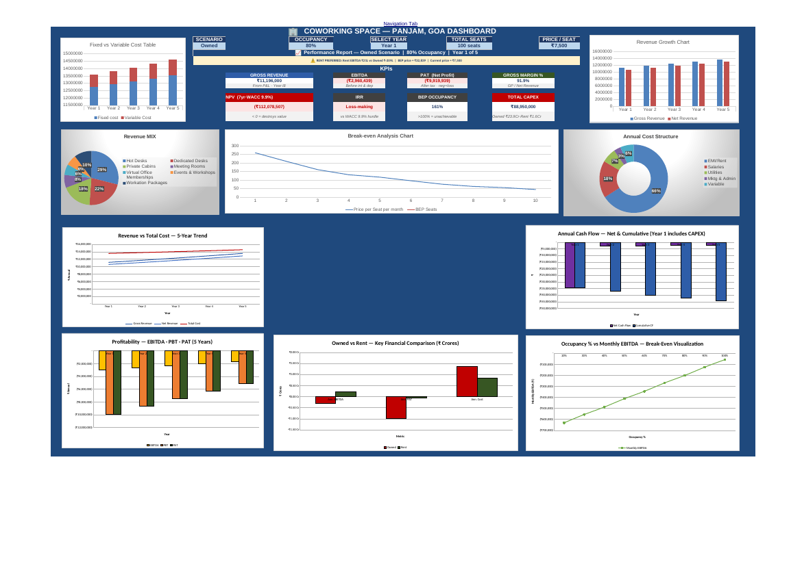
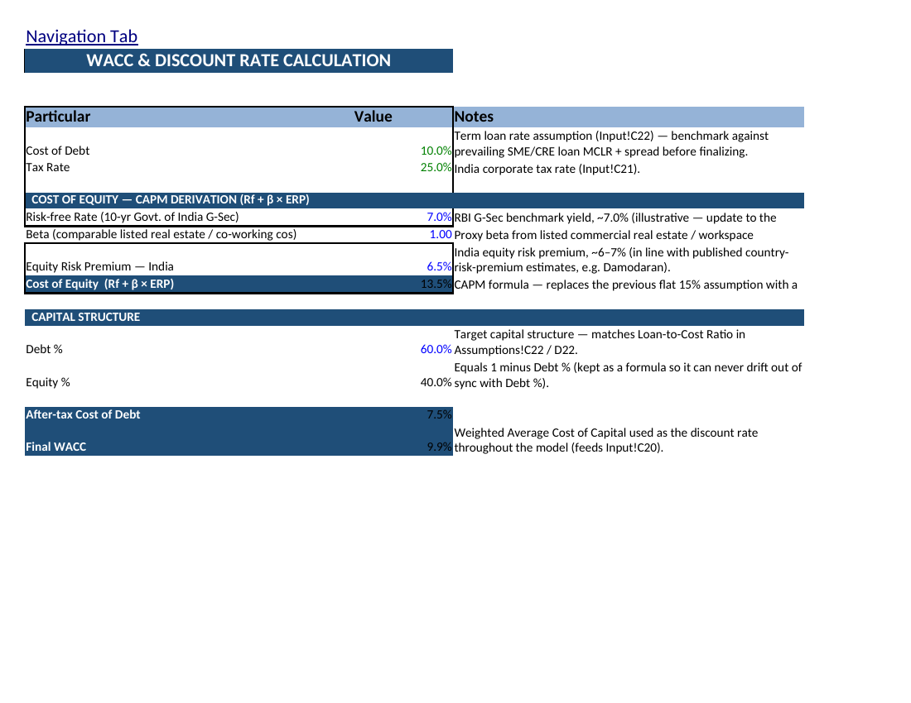
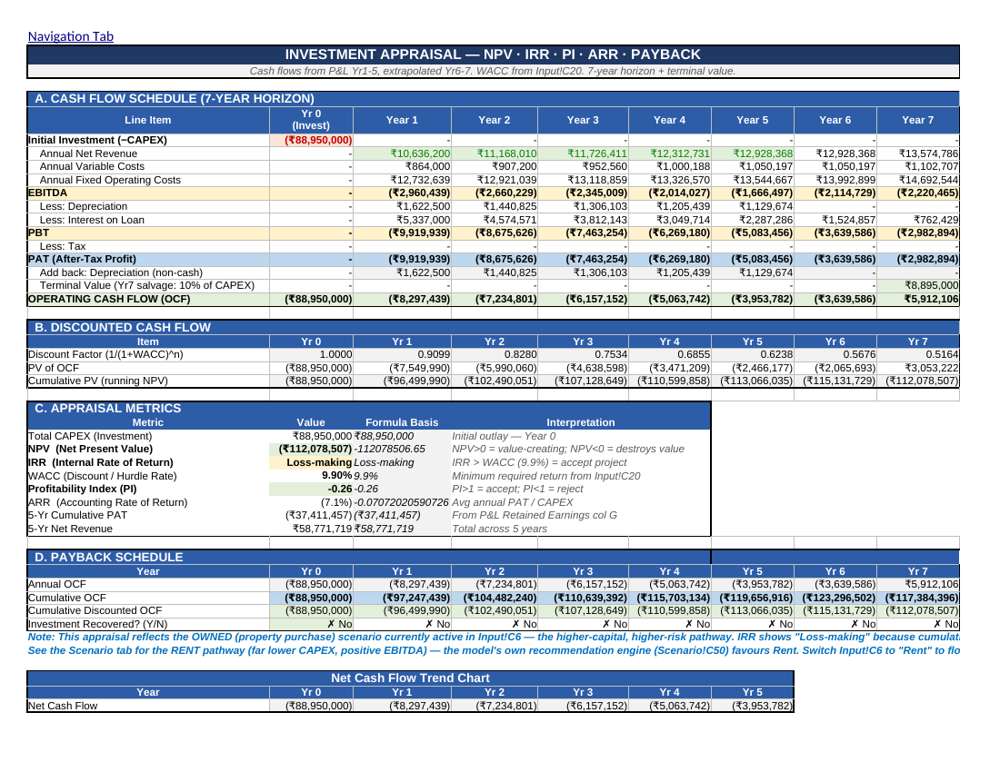
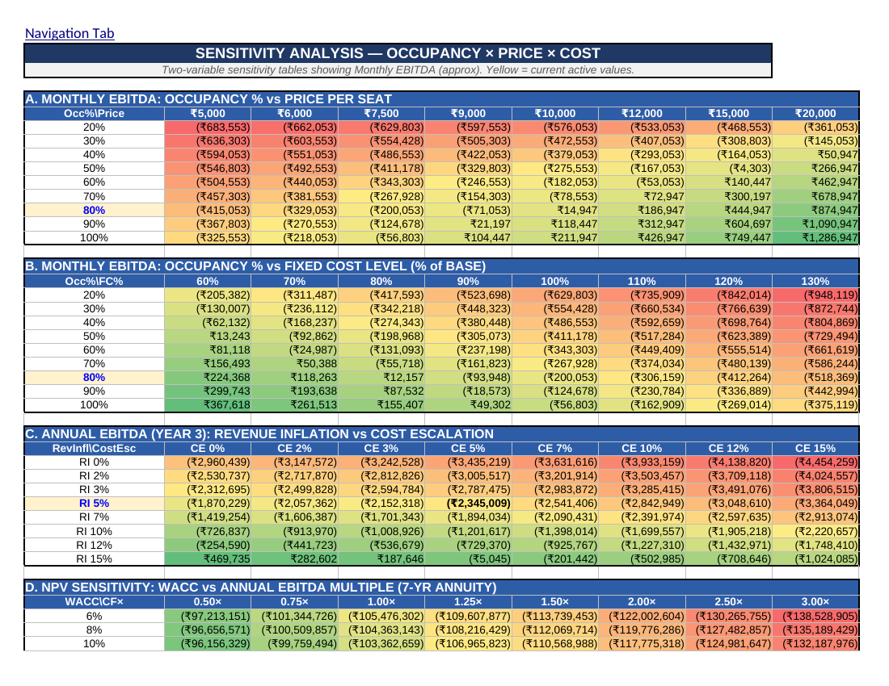
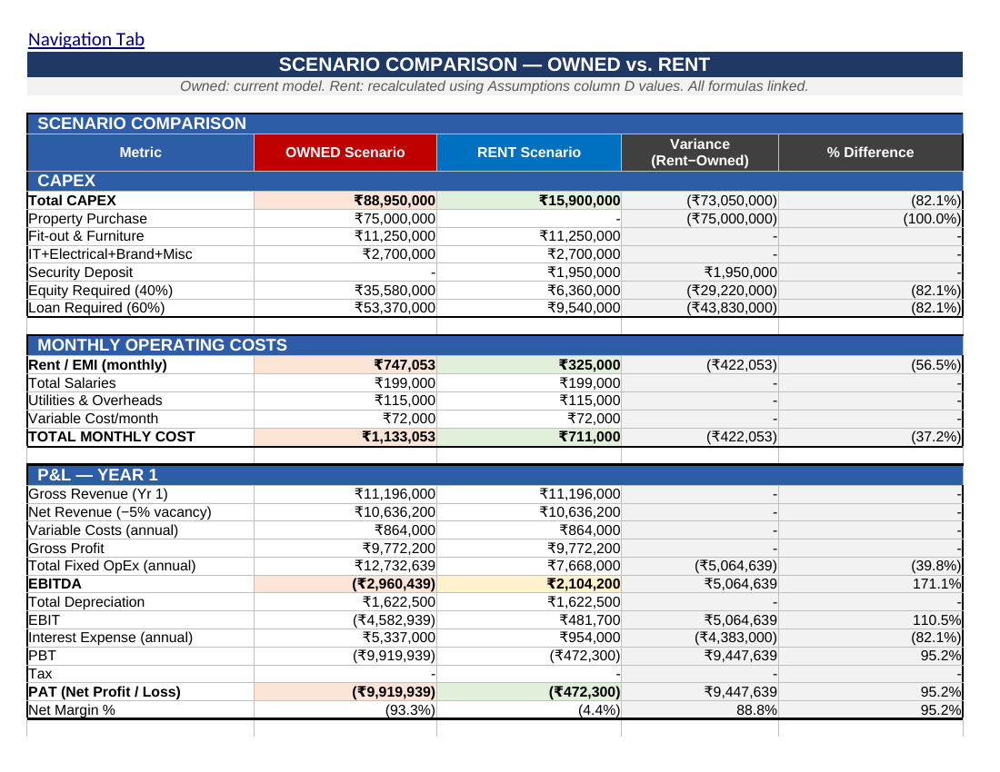
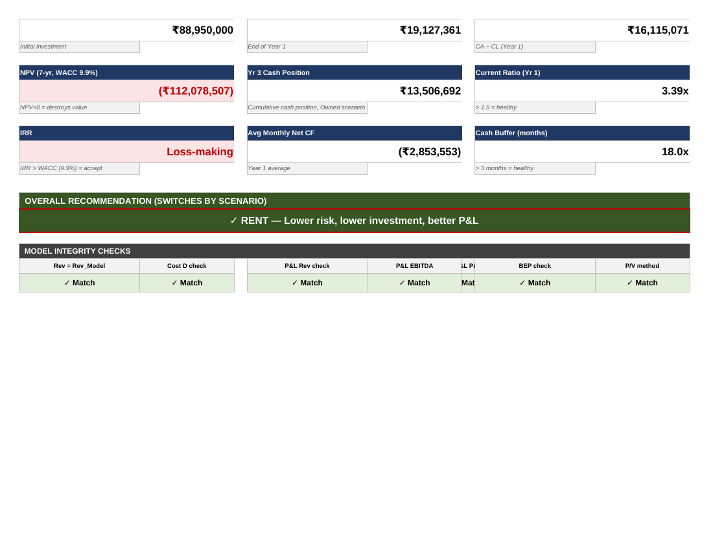

# Coworking Space Financial Feasibility Model — Panjim, Goa

A full financial feasibility model evaluating whether to launch a 100-seat coworking space in Panjim, Goa — built to compare a capital-intensive **property purchase** path against a lower-risk **lease** path, using 3-statement modelling, DCF valuation, and investment appraisal.

## Business Problem

A coworking operator is deciding how to fund a new 100-seat location in Panjim: buy the property outright, or lease it. The model answers three questions:
1. Is either path financially viable at current market pricing (₹7,500/seat/month, 80% occupancy)?
2. What discount rate and return threshold should the decision be judged against?
3. Which path — Owned or Rent — creates value, and under what conditions?

## Data Sources & Assumptions

Market inputs are benchmarked against public listings and industry sources, cited inline in the workbook (Input sheet, "Market Benchmarks" section):
- Coworking pricing: Qdesq, GoFloaters
- Commercial rent / property values: MagicBricks, indicative local broker range
- Discount rate: CAPM-derived — 10-yr Govt. of India G-Sec risk-free rate, a proxy beta from listed commercial real estate/workspace comparables, and an India equity risk premium (in line with published country-risk-premium estimates)

All hardcoded assumptions are colour-coded (blue = input) and annotated with a source or rationale in the adjacent Notes column, so every number in the model is traceable.

## Methodology

- **3-statement model**: Revenue → Cost Sheet → P&L → Cash Budget, fully driven by a single scenario toggle (Owned / Rent) on the Input sheet
- **WACC via CAPM**: Cost of Equity = Risk-free Rate + Beta × Equity Risk Premium, weighted with post-tax Cost of Debt by target capital structure
- **Investment appraisal**: 7-year DCF with terminal value, NPV, IRR, Profitability Index, ARR, and a year-by-year payback schedule
- **Break-even and sensitivity analysis**: occupancy vs. price, occupancy vs. fixed-cost level, revenue inflation vs. cost escalation, and WACC vs. EBITDA multiple — each as a full 2-variable data table
- **Scenario comparison**: Owned vs. Rent evaluated side by side on CAPEX, monthly operating cost, and Year-1 P&L, with an automated recommendation rule

## Key Outputs

**Executive Dashboard**

**WACC — CAPM Derivation**

**Investment Appraisal — NPV / IRR / Payback**

**Sensitivity Analysis — Occupancy × Price × Cost**

**Scenario Comparison — Owned vs. Rent**

**Executive Summary & Recommendation**

## Findings & Recommendation

At current pricing (₹7,500/seat/month, 80% occupancy), the **Owned (property purchase)** path destroys value: NPV of **−₹11.2 Cr** at a CAPM-derived WACC of **9.9%**, with cumulative cash flow never recovering the ₹8.9 Cr initial investment within the 7-year horizon.

The **Rent** path is materially different: CAPEX drops ~82% to ₹1.59 Cr, Year-1 EBITDA turns positive (₹21 L vs. −₹30 L for Owned), and payback is a defined 13.8 years rather than undefined.

**Recommendation:** Proceed on the Rent path. The Owned path only becomes competitive if achievable pricing rises well above the current break-even price of ~₹32,800/seat/month — roughly 4.4× today's market rate — making it unrealistic under present market conditions. This is a conditional, evidence-based recommendation rather than a blanket accept/reject.

## Tools Used

Excel — 3-statement modelling, DCF/CAPM, Data Tables (sensitivity), Scenario comparison, conditional formatting for exception-highlighting.

## Limitations & Next Steps

- Beta and equity risk premium are proxy/illustrative figures — should be refreshed against current comparable-company data before using this model for an actual investment decision.
- A full multi-year IRR is built out for the Owned path only; the Rent path is evaluated on NPV and cash-flow-basis payback (see the Scenario tab for the calculation and rationale).
- Next step: sensitize the model to a range of achievable price points and occupancy ramps by month (rather than a flat Year-1 assumption) to test the timing of break-even more precisely.
